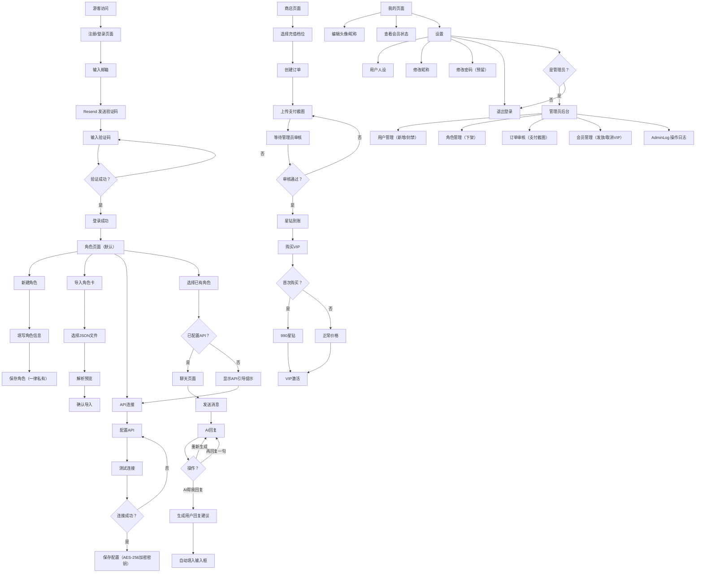

# 叙境（Xujing）Architecture Freeze Report

> **版本**：V1.1
> **日期**：2026-06-07
> **阶段**：Phase 0 - 架构设计阶段
> **产品定义**：叙境 MVP 产品定义 V1.0（PROJECT_RULES.md 第二节）
> **状态**：已通过，可进入 Database Phase
> **V1.1 变更**：删除 SEO 数据结构设计、角色广场严格不开发、官方角色标记、钱包截图审核流程、User 状态字段、AdminLog 实体、AES-256 加密

---

## 1. 产品边界确认

### 1.1 MVP 包含（Must Have）

| 体系 | 内容 |
|------|------|
| **用户体系** | 邮箱验证码注册/登录（Resend）、普通用户（2角色/自备API/100条记忆）、VIP用户（无限角色/平台模型或自备API/10000条记忆）、管理员、用户状态（ACTIVE/BANNED） |
| **商业体系** | 星钻货币（1元=100星钻）、6档充值（4.9/9.9/19.9/29.9/71.9/199.9元）、VIP月卡/季卡/年卡、首次月卡优惠（990星钻）、创建订单→上传支付截图→后台审核→星钻到账 |
| **角色体系** | 新建角色（必填：名字/设定/开场白，可选：图片/高级定义/扩展字段/系统指令）、JSON角色卡导入（叙境/Tavern/SillyTavern格式）、角色管理（编辑/导出/复制/删除）、2个官方免费角色（System Character，不计入用户角色额度） |
| **聊天体系** | 微信风格聊天界面、AI消息操作（重新生成/再回复一句/AI帮我回复）、角色顶部信息（头像/名称/记忆状态）、普通用户未配置API时显示引导提示 |
| **API连接** | 5个内置平台（OpenAI/Anthropic/Gemini/DeepSeek/Grok）+ 3种自定义兼容协议、测试连接功能、VIP平台模型（DeepSeek V4 Flash，显示为"VIP专属模型"）、API Key AES-256加密存储 |
| **我的页面** | 头像上传、昵称设置、邮箱/用户ID显示、会员状态展示、用户人设（全角色共享） |
| **管理员后台** | 用户管理（新增/封禁）、角色管理（下架）、订单审核（充值截图审核）、会员管理（发放/取消VIP）、AdminLog 操作日志 |
| **底部导航** | 固定4项：角色、聊天、商店、我的。禁止隐藏，禁止首页 |

### 1.2 MVP 不包含（Will NOT Have）

| 体系 | 排除项 |
|------|--------|
| **数值系统** | 好感度、亲密度、爱情值、关系等级、+5好感/+10亲密/Lv3关系 |
| **扩展系统** | 世界系统、剧情系统、任务系统、签到系统、排行榜、邀请码系统、Agent系统 |
| **社交系统** | 多角色群聊、创作者分成、角色广场（严格不开发，不做数据库设计） |
| **其他** | 首页（登录后直接进入角色页） |

### 1.3 产品定义冲突检查与 V1.1 裁决

**冲突 1：角色广场入口**

- **裁决**：角色广场严格不开发。角色创建时的公开开关仅保留 UI 展示，实际一律保存为私有角色。不设计任何角色广场相关数据库结构。用户点击公开选项时弹出"请等待作者大大更新~"。

**冲突 2：VIP 模型名称隐藏**

- **裁决**：商业策略，非技术冲突。前端硬编码显示"VIP专属模型"，后端配置实际模型路由。

**冲突 3：记忆容量与长期记忆定义**

- **裁决**：采用 RAG 检索增强模式（非全量注入），按相关性取 top-N 条注入上下文。达到上限后按重要性权重淘汰旧记忆。具体 N 值待 Phase 3 确认。

---

## 2. 用户流程图



---

## 3. 页面地图（Page Map）

| # | 页面名称 | 路由 | 登录要求 | 用户权限 | 说明 |
|---|---------|------|---------|---------|------|
| 1 | 登录/注册 | `/login` | 无需登录 | 游客 | 邮箱+验证码登录注册合一 |
| 2 | 角色列表 | `/characters` | 登录后 | 普通/VIP/管理员 | 登录默认页面，显示"我的角色"+ System Character + 新建/导入入口 |
| 3 | 新建角色 | `/characters/new` | 登录后 | 普通（限2个）/VIP（无限） | 角色信息表单，含高级定义和扩展字段折叠区。公开开关一律保存为私有 |
| 4 | 导入角色卡 | `/characters/import` | 登录后 | 普通/VIP | 选择JSON → 解析 → 预览 → 确认导入四步流程 |
| 5 | API连接 | `/characters/api` | 登录后 | 普通/VIP | 配置API平台/密钥/模型，支持测试连接 |
| 6 | 角色管理 | `/characters/[id]/manage` | 登录后 | 角色所有者 | 编辑/导出/复制/删除 |
| 7 | 聊天页 | `/chat/[characterId]` | 登录后 | 普通（需配置API）/VIP | 微信风格聊天界面。普通用户未配置API时显示引导 |
| 8 | 商店 | `/store` | 登录后 | 普通/VIP | 充值档位选择 → 创建订单 → 上传截图 → VIP购买 |
| 9 | 我的 | `/me` | 登录后 | 普通/VIP | 头像/昵称/邮箱/ID/会员状态 |
| 10 | 设置 | `/me/settings` | 登录后 | 普通/VIP | 用户人设、修改昵称、修改密码（预留）、退出登录 |
| 11 | 管理员后台 | `/admin` | 登录后 | 仅管理员 | 用户管理/角色管理/订单审核/会员管理/操作日志 |

> **注意**：导航栏固定4项（角色/聊天/商店/我的）。已删除角色广场相关路由。

---

## 4. 数据实体识别

> **本阶段不设计数据库**，仅识别实体及其职责。

### 4.1 实体清单

| 实体 | 英文名 | 核心职责 | 关键属性 |
|------|--------|---------|---------|
| **用户** | User | 账户管理、身份认证、角色配额、VIP状态 | 邮箱、昵称、头像、角色（NORMAL/VIP/ADMIN）、**状态（ACTIVE/BANNED）**、VIP到期时间、星钻余额、用户人设 |
| **角色** | Character | 角色定义、对话人格、记忆容器 | 名字、头像、背景图、角色设定、开场白、性格特点、情景设定、对话示例、Main Prompt、Post-History Instructions、**是否为System Character（官方角色）** |
| **聊天消息** | Message | 对话记录存储、上下文管理 | 角色ID、用户ID、发送方（user/assistant）、消息内容、时间戳 |
| **长期记忆** | Memory | 提取和存储关键记忆点 | 角色ID、用户ID、记忆内容、重要性权重、创建时间 |
| **API配置** | ApiConfig | 用户自备API连接信息 | 用户ID、配置名称、平台类型、接口地址、**API密钥（AES-256加密存储）**、模型ID |
| **充值订单** | Order | 星钻充值订单、支付截图审核 | 用户ID、充值档位（金额/星钻数）、**支付截图文件路径**、订单状态（待支付→待审核→已完成/已拒绝）、审核备注、审核管理员ID |
| **VIP记录** | VipRecord | VIP购买历史和到期管理 | 用户ID、套餐类型（月/季/年）、花费星钻、是否首次购买、激活时间、到期时间 |
| **管理员日志** | AdminLog | 管理员操作审计 | 管理员ID、操作类型、操作目标、操作详情（JSON）、IP地址、时间戳 |

### 4.2 实体关系简述

```
User  1 ──── N  Character    （一个用户拥有多个角色）
User  1 ──── N  ApiConfig     （一个用户可配置多个API）
User  1 ──── N  Order         （一个用户有多次充值记录）
User  1 ──── N  VipRecord     （一个用户有多次VIP购买记录）
User  1 ──── N  AdminLog      （一个管理员产生多条操作日志）
User  1 ──── 1  User（自身）   （VIP状态、星钻余额、人设、封禁状态属于用户自身属性）

Character 1 ──── N  Message   （一个角色有多条聊天消息）
Character 1 ──── N  Memory    （一个角色有多条长期记忆）

Character 属于 User（普通用户限2个，VIP无限，System Character 的 user_id=NULL 且不计入用户角色额度）
Message 同时关联 Character 和 User（用于区分对话双方）
Memory 按角色+用户隔离（不同用户与同一角色有独立记忆）
ApiConfig 的 api_key 字段使用 AES-256 加密存储，仅在服务端解密使用
```

### 4.3 数据库阶段禁止设计的表

明确禁止在数据库设计中创建以下任何表结构：
- 好感度表
- 关系等级表
- 角色广场/角色公开表
- 角色热度/排行表
- 任何与角色广场相关的关联表

---

## 5. 模块拆解

### 5.1 认证模块（Auth Module）

| 维度 | 说明 |
|------|------|
| **输入** | 用户邮箱地址、验证码 |
| **输出** | JWT Token / Session、用户身份信息（含 status 字段） |
| **核心逻辑** | Resend API 发送6位验证码 → Redis 缓存（5分钟有效）→ 验证通过后创建/查找用户 → 签发 Token。BANNED 用户拒绝登录 |
| **依赖** | Resend 邮件服务、Redis（验证码缓存） |
| **关键决策** | 验证码单日发送上限10次/邮箱、登录后直接跳转角色页 |

### 5.2 角色模块（Character Module）

| 维度 | 说明 |
|------|------|
| **输入** | 角色信息、JSON角色卡文件 |
| **输出** | 角色对象、角色列表 |
| **核心逻辑** | 创建角色时检查配额（普通用户≤2，System Character不计入）→ 导入JSON解析三种格式 → 角色公开开关仅UI展示，实际一律保存为私有（is_public=false）→ 支持导出/复制/删除 |
| **依赖** | 用户模块（配额检查）、文件解析（JSON） |
| **关键决策** | System Character 通过 is_official 字段标记，user_id=NULL；删除角色级联删除消息和记忆；公开开关点击弹出"请等待作者大大更新~" |

### 5.3 聊天模块（Chat Module）

| 维度 | 说明 |
|------|------|
| **输入** | 用户消息文本 |
| **输出** | AI 回复、操作结果 |
| **核心逻辑** | 前置检查：普通用户未配置 API → 返回引导提示禁止聊天 → 组装 prompt → 调用 AI API → SSE 流式返回 → 存储消息 → 异步提取长期记忆 |
| **依赖** | API连接模块、记忆模块、角色模块 |
| **关键决策** | 普通用户必须已配置 API 才能聊天；VIP 可选平台模型；API 密钥仅在服务端解密使用，永不暴露前端 |

### 5.4 记忆模块（Memory Module）

| 维度 | 说明 |
|------|------|
| **输入** | 聊天消息对（用户+AI） |
| **输出** | 长期记忆条目 |
| **核心逻辑** | 每轮对话后异步提取 → 去重/合并 → 检查容量（普通100条/VIP10000条）→ 超限时按重要性权重淘汰 → 下次对话时 RAG 检索 top-N 注入上下文 |
| **依赖** | 聊天模块、AI API（提取记忆） |
| **关键决策** | RAG 检索增强模式；补充 prompt 仅拼接文本，禁止注入数值化好感度 |

### 5.5 API连接模块（API Connection Module）

| 维度 | 说明 |
|------|------|
| **输入** | API平台类型、接口地址、API密钥、模型ID |
| **输出** | 连接测试结果 |
| **核心逻辑** | 自动填充默认地址 → 测试连接（超时10秒）→ AES-256 加密密钥 → 存储。解密仅在发起 AI 请求时服务端执行 |
| **依赖** | 无 |
| **关键决策** | AES-256-CBC，密钥派生自环境变量；VIP 平台模型路由独立处理 |

### 5.6 钱包模块（Wallet Module）

| 维度 | 说明 |
|------|------|
| **输入** | 充值档位选择、支付截图 |
| **输出** | 订单记录、星钻余额（审核通过后） |
| **核心逻辑** | 选择档位 → 创建订单（状态：待支付）→ 展示收款码 → 用户支付后上传截图 → 订单状态变为待审核 → 管理员在后台审核 → 通过则星钻到账（订单完成），拒绝则标注原因（订单已拒绝） |
| **依赖** | 用户模块（余额变更）、管理员模块（订单审核）、AdminLog（记录审核操作） |
| **关键决策** | 订单状态机：待支付 → 待审核 → 已完成 / 已拒绝；审核操作写入 AdminLog；防重复审核机制 |

### 5.7 会员模块（VIP Module）

| 维度 | 说明 |
|------|------|
| **输入** | VIP套餐类型选择 |
| **输出** | VIP状态激活/续期 |
| **核心逻辑** | 检查首次购买标志 → 应用优惠价格 → 扣减星钻 → 激活VIP → 记录 VipRecord |
| **依赖** | 钱包模块（星钻扣减）、用户模块（VIP状态更新） |
| **关键决策** | "首次购买"基于是否有 completed 状态的 VipRecord；VIP到期自动降级；管理员手动发放VIP时可选"不计入首次购买" |

### 5.8 后台模块（Admin Module）

| 维度 | 说明 |
|------|------|
| **输入** | 管理员操作指令 |
| **输出** | 管理操作结果 + AdminLog 记录 |
| **核心逻辑** | 角色鉴权（仅 ADMIN）→ 用户管理（新增/封禁/解封）→ 角色管理（下架）→ 订单审核（查看截图→通过/拒绝）→ VIP管理（发放/取消） |
| **依赖** | 所有业务模块、AdminLog |
| **关键决策** | 封禁用户拒绝登录；下架角色不影响已有聊天；所有管理员操作写入 AdminLog（操作类型、目标、详情、IP、时间） |

---

## 6. 技术架构建议

### 6.1 技术选型及理由

| 技术 | 选型理由 | 潜在风险 |
|------|---------|---------|
| **Next.js (App Router)** | 文件系统路由天然匹配 11 个页面结构；API Routes 统一前后端；SSR 对登录页友好 | App Router 学习曲线；RSC 与客户端交互边界 |
| **PostgreSQL** | 关系型数据适合用户-角色-消息-订单关联查询；JSONB 支持角色卡弹性字段；事务保证充值/VIP 扣减原子性 | 部署配置 |
| **Docker** | 统一环境；Next.js + PostgreSQL + Redis 编排；Cloudflare Tunnel 网络隔离 | 镜像体积管理 |
| **Cloudflare Tunnel** | 无需开放端口；自动 HTTPS；免费套餐 | 依赖 Cloudflare 可用性 |
| **Resend** | 官方邮件 API；React 邮件模板；免费额度 100封/天 | 国内邮箱送达率需实测 |

### 6.2 建议补充的技术组件

| 组件 | 用途 | 优先级 |
|------|------|--------|
| **Redis** | 验证码缓存（5分钟TTL）、会话管理、API 速率限制 | 必须 |
| **Drizzle ORM** | 类型安全的数据库操作，与 Next.js + PostgreSQL 配合 | 推荐 |
| **Tailwind CSS** | 快速实现微信风格聊天UI和响应式布局 | 推荐 |
| **node:crypto (AES-256-CBC)** | API Key 加密存储 | 必须 |

### 6.3 AI API 代理架构

```
用户浏览器 → Next.js API Route (/api/chat)
  → 读取用户 API 配置（服务端 AES-256 解密密钥）
  → 组装 prompt（系统指令 + 角色设定 + 记忆 + 历史）
  → 请求 AI API（OpenAI/Anthropic/Gemini/DeepSeek/Grok）
  → SSE 流式返回给前端
```

> **关键**：API 密钥仅服务端解密使用，永不暴露前端。流式响应通过 ReadableStream 实现。

---

## 7. 移动端适配策略

### 7.1 目标设备

- iPhone（iOS Safari）：iPhone 12 ~ 16 系列，屏幕比例 19.5:9 ~ 20:9
- Android（Chrome）：主流品牌旗舰/中端机型，屏幕比例 19.5:9 ~ 21:9

### 7.2 核心问题与解决方案

| 问题 | 旧叙境已知风险 | 解决方案 |
|------|-------------|---------|
| **底部导航被遮挡** | 固定定位底部导航在 iOS Safari 工具栏展开时被遮挡 | 使用 `env(safe-area-inset-bottom)` 增加底部 padding；导航栏使用 `position: fixed; bottom: 0` + `padding-bottom: env(safe-area-inset-bottom, 0px)` |
| **顶部状态栏遮挡** | 刘海屏/打孔屏顶部内容被遮挡 | 使用 `env(safe-area-inset-top)` 作为页面顶部 padding；`<meta name="viewport" content="viewport-fit=cover">` |
| **Safe Area 问题** | iOS 底部横条区域内容不可交互 | 所有交互元素需在 safe area 之外至少 8px |
| **100vh 问题** | `height: 100vh` 在移动浏览器中导致内容溢出 | 使用 `dvh` 或 `-webkit-fill-available`；聊天区域使用 `flex: 1` + 固定头部/底部计算剩余高度 |
| **PWA 兼容** | iOS PWA 独立窗口模式下行为不同 | 配置 `apple-mobile-web-app-capable`、`apple-mobile-web-app-status-bar-style` meta 标签 |
| **键盘弹出** | 键盘弹出时聊天输入框被遮挡 | 使用 `visualViewport` API 监听键盘高度变化，动态调整聊天区域高度 |

### 7.3 聊天页布局策略

```
┌──────────────────────────┐
│  safe-area-inset-top      │ ← env() 动态值
│  角色头像 + 名称 + 记忆    │ ← 固定头部，~56px
├──────────────────────────┤
│                          │
│  聊天记录                  │ ← flex: 1，overflow-y: auto
│  （消息列表）              │
│                          │
├──────────────────────────┤
│  输入框 + 发送按钮         │ ← 固定底部，padding-bottom: env(safe-area-inset-bottom)
├──────────────────────────┤
│  底部导航栏                │ ← position: fixed; bottom: 0
│  padding-bottom:          │
│  env(safe-area-inset-bottom)
└──────────────────────────┘
```

### 7.4 关键 CSS 变量

```css
:root {
  --safe-top: env(safe-area-inset-top, 0px);
  --safe-bottom: env(safe-area-inset-bottom, 0px);
  --safe-left: env(safe-area-inset-left, 0px);
  --safe-right: env(safe-area-inset-right, 0px);
  --nav-height: 56px;
  --header-height: 56px;
  --chat-available-height: calc(100dvh - var(--header-height) - var(--nav-height) - var(--safe-top) - var(--safe-bottom));
}
```

### 7.5 响应式断点

| 断点 | 宽度 | 适配策略 |
|------|------|---------|
| 移动端 | < 768px | 主目标：全屏布局、底部导航、微信风格聊天 |
| 平板 | 768px - 1024px | 聊天区域最大宽度 600px 居中 |
| 桌面 | > 1024px | 聊天区域最大宽度 720px 居中 |

> MVP 优先保证移动端体验。

---

## 8. 风险清单

### 高风险

| # | 风险 | 影响 | 缓解措施 |
|---|------|------|---------|
| R1 | **AI API 代理可用性**：用户自备 API 可能不可用；平台 DeepSeek V4 Flash 可能限流 | 聊天功能完全不可用 | 实现请求超时+重试机制（最多2次）；平台模型配置备用渠道；前端展示明确错误提示 |
| R2 | **支付截图审核效率**：手动审核存在延迟和误判风险 | 用户等待到账时间长、纠纷 | 订单状态机严格设计；审核操作写入 AdminLog 审计；后台审核界面优化（大图预览、一键通过/拒绝） |
| R3 | **记忆上限策略**：普通100条/VIP10000条，淘汰逻辑不当会丢失重要记忆 | 角色"失忆"影响用户体验 | 按重要性权重淘汰最低权重记忆；具体权重算法 Phase 3 确认 |

### 中风险

| # | 风险 | 影响 | 缓解措施 |
|---|------|------|---------|
| R4 | **Resend 国内邮箱送达率**：QQ/163邮箱可能拦截 | 用户收不到验证码 | 上线前实测；配置 SPF/DKIM/DMARC；准备备用邮件服务商 |
| R5 | **VIP 首次购买逻辑**：手动发放VIP可能破坏首次判断 | 优惠错误发放 | 首次购买标志写入 User 冗余字段；管理员手动发放 VIP 可选"不计入首次购买" |
| R6 | **角色卡导入兼容性**：三种格式字段差异大 | 导入失败或信息丢失 | 建立字段映射表；导入失败保留原始 JSON；提供导入预览步骤 |

### 低风险

| # | 风险 | 影响 | 缓解措施 |
|---|------|------|---------|
| R7 | **底部导航 + 键盘交互** | iOS Safari 键盘弹出时布局异常 | 第7节已覆盖 Safe Area 和 visualViewport 方案 |
| R8 | **Docker PostgreSQL 数据持久化** | 容器重启数据丢失 | Docker volume 挂载；定期备份 |
| R9 | **Cloudflare Tunnel 稳定性** | 服务短暂不可用 | 健康检查+自动重启；监控告警 |

---

## 9. 待项目负责人确认事项

### 9.1 需要提供的配置信息

| # | 配置项 | 用途 | 状态 |
|---|--------|------|------|
| C1 | **Resend API Key** | 发送邮箱验证码 | ⏳ 待提供 |
| C2 | **PostgreSQL 连接信息**（host/port/user/password/dbname） | 数据库设计 | ⏳ 待提供 |
| C3 | **Docker 运行环境信息**（服务器 IP/SSH/已安装组件） | 部署架构 | ⏳ 待提供 |
| C4 | **Cloudflare Tunnel 配置**（域名/token） | 外网访问 | ⏳ 待提供 |
| C5 | **域名信息**（叙境分站完整的访问地址） | 页面路由 | ⏳ 待提供 |
| C6 | **支付宝/微信收款码图片** | 商店充值页面 | ⏳ 待提供 |
| C7 | **管理员账号**（邮箱） | 后台初始化 | ⏳ 待提供 |
| C8 | **2个官方角色 JSON 文件**（System Character） | 角色系统初始化 | ⏳ 待提供 |
| C9 | **DeepSeek V4 Flash API 信息**（endpoint/key） | VIP 平台模型 | ⏳ 待提供 |
| C10 | **AES-256 加密密钥**（32字节，环境变量） | API Key 加密 | ⏳ 待提供 |

### 9.2 产品定义需澄清的问题

| # | 问题 | 方案 A | 方案 B | 建议 |
|---|------|--------|--------|------|
| Q1 | **记忆达到上限时的行为** | 停止提取新记忆 | 按重要性权重淘汰旧记忆 | 建议 **方案 B** |
| Q2 | **"再回复一句"的实现方式** | 发送空消息 | 发送特殊指令"请继续" | 建议 **方案 B** |
| Q3 | **订单审核超时处理** | 24小时未审核自动拒绝 | 无超时，等待人工处理 | 建议 **方案 A** |

### 9.3 架构决策需确认

| # | 决策点 | 建议 | 需确认 |
|---|--------|------|--------|
| D1 | ORM 选型 | **Drizzle** — 轻量、SQL-like、Next.js 兼容 | 同意 / 反对 |
| D2 | CSS 方案 | **Tailwind CSS** — 快速开发、微信风格 UI | 同意 / 反对 |
| D3 | 验证码有效期 | **5分钟** | 同意 / 调整 |
| D4 | 普通用户每日验证码上限 | **10次/邮箱/天** | 同意 / 调整 |

---

## 10. V1.1 变更记录

| # | 变更项 | 说明 |
|---|--------|------|
| 1 | 删除 SEO 数据结构设计 | 原第8节 SEO 策略已移除。登录页 SEO 为基础 meta 标签，不涉及数据结构设计 |
| 2 | 角色广场严格不开发 | 公开开关仅保留 UI，实际一律保存为私有。点击弹出"请等待作者大大更新~"。不设计角色广场数据库结构 |
| 3 | 官方角色标记 | System Character，is_official=true，user_id=NULL，不计入用户角色额度 |
| 4 | 普通用户 API 引导 | 未配置 API 时聊天页显示引导提示，禁止发起聊天 |
| 5 | 钱包截图审核流程 | 创建订单 → 上传支付截图 → 后台审核 → 星钻到账。订单状态机：待支付→待审核→已完成/已拒绝 |
| 6 | 后台增加订单审核 | 管理员审核支付截图，操作写入 AdminLog |
| 7 | User 增加 status | ACTIVE / BANNED，封禁用户拒绝登录 |
| 8 | 增加 AdminLog 实体 | 记录管理员操作类型、目标、详情、IP、时间 |
| 9 | API Key AES-256 加密 | AES-256-CBC，密钥来自环境变量，仅在服务端解密使用 |
| 10 | 数据库阶段禁止项 | 禁止设计好感度、关系等级、角色广场相关表 |

---

## 阶段结束声明

Phase 0 - Architecture Freeze Report V1.1 已完成。全部 10 项 V1.1 修改已落地。

**状态**：**已通过，可进入 Database Phase**

**下一步**：Phase 1 - 数据库设计阶段