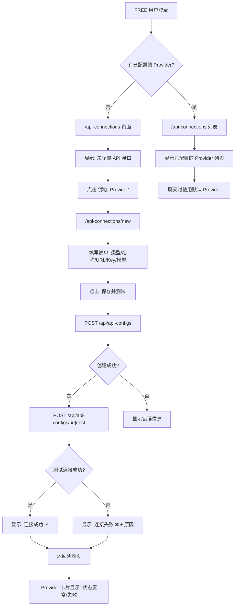
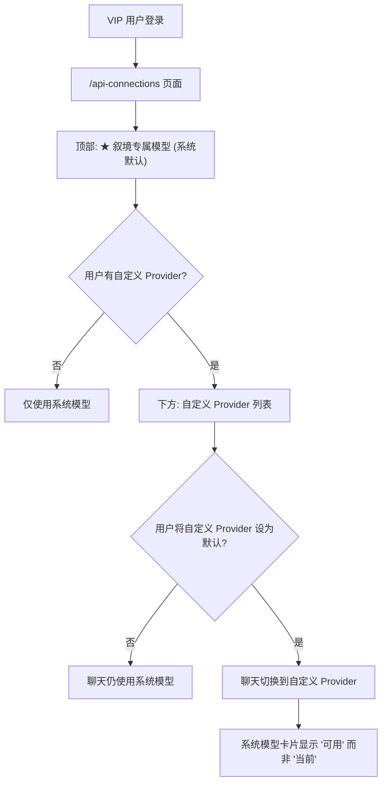
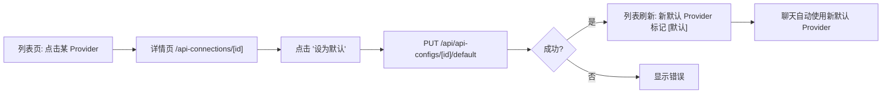
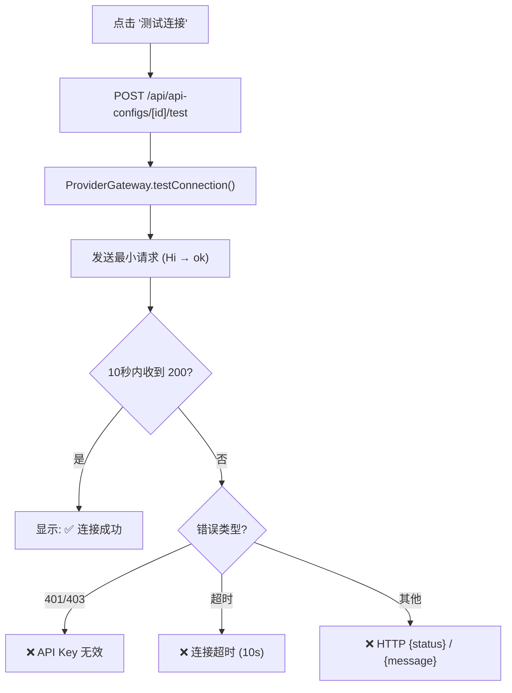
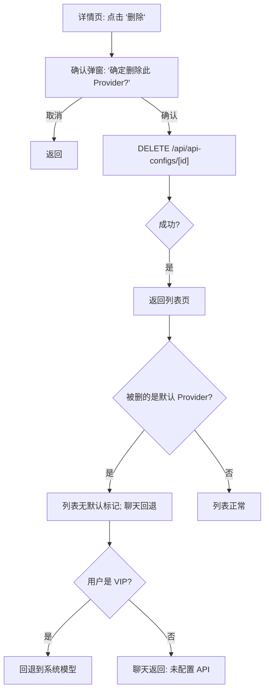

# Phase 6 — Provider Routing & User Flow

> **版本**: V1.0 | **日期**: 2026-06-07

---

## 1. FREE 用户完整流程



### 关键决策点

| 节点 | 条件 | 行为 |
|------|------|------|
| 无 Provider 时聊天 | FREE + 无 api_configs | 返回 `"未配置 API 接口，请前往 API 连接页面配置"` |
| 有 Provider 但测试失败 | FREE + 有 config + 测试失败 | 允许使用（由用户自行判断），标记状态为"未测试"或"失败" |
| 多个 Provider | FREE + 多个 configs | 使用 `is_default=true` 的 Provider |

## 2. VIP 用户完整流程



### VIP 模型优先级

```
聊天时选择模型的优先级:
1. 用户自定义 Provider (is_default=true) → 使用该 Provider
2. 无自定义默认 → 使用平台模型 (getPlatformConfig)
```

### VIP 系统模型展示规则

| 场景 | 系统模型卡片显示 |
|------|----------------|
| 无自定义默认 Provider | ★ 叙境专属模型 **[当前]** |
| 已设置自定义默认 Provider | ★ 叙境专属模型 (可用) |
| 自定义 Provider 被删除 | 自动回退到系统模型，恢复 [当前] |

## 3. Provider 切换流程



> `setDefault` 为事务操作：先清除该用户所有 `is_default=true`，再设置目标配置。保证原子性。

## 4. 测试连接流程



## 5. 删除 Provider 流程



## 6. API Route 权限矩阵

| Route | Method | Auth | FREE | VIP | ADMIN |
|-------|--------|------|------|-----|-------|
| `/api/api-configs` | GET | ✅ | ✅ 自己的列表 | ✅ | ✅ |
| `/api/api-configs` | POST | ✅ | ✅ | ✅ | ✅ |
| `/api/api-configs/[id]` | PUT | ✅ | ✅ (自己的) | ✅ | ✅ |
| `/api/api-configs/[id]` | DELETE | ✅ | ✅ (自己的) | ✅ | ✅ |
| `/api/api-configs/[id]/test` | POST | ✅ | ✅ | ✅ | ✅ |
| `/api/api-configs/[id]/default` | PUT | ✅ | ✅ | ✅ | ✅ |

> 所有操作均校验 `config.userId === auth.userId`，Service 层已实现归属检查。

---

**下一文档**: 05-provider-validation-rules.md